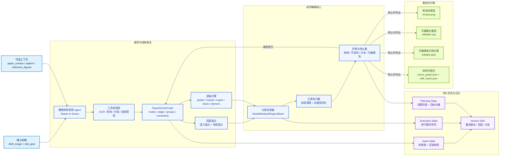
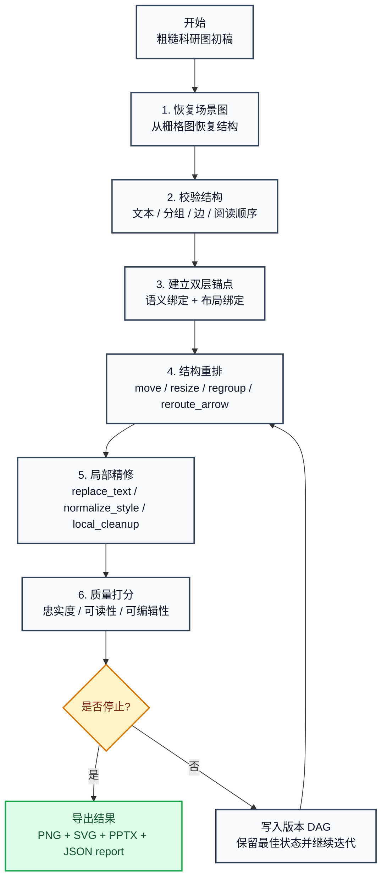

# Figure Agent

一个面向论文作者的科研图后编辑 Agent 原型。

当前版本实现了：

- `FigureSceneGraph` 作为统一中间表示
- 双层锚点：语义锚点 + 布局锚点
- 分治式层级结构编辑：全图 / 模块 / 分区 / 区块 / 元素五层
- 栅格初稿到场景图的原型化恢复接口
- 验证层、层级分解、分层协调、布局规划、局部精修、Critic/Stopper 闭环
- PNG / SVG / PPTX 导出
- `AnchorFigureBench-v1` 合成 benchmark 生成
- 自动评测、失败分析、实验 runner 与人工评测模板
- 基准样例生成与最小 Web Demo

## 当前 Idea

这个项目当前的核心想法不是“从论文文本一步生成最终图”，而是先把它做成一个**科研图后编辑 Agent**：

- 输入是 `draft_image + edit_goal`，可选补充 `paper_context / caption / reference_figures`
- 系统先把粗糙栅格初稿恢复为结构化的 `FigureSceneGraph`
- 再围绕 `语义锚点 + 布局锚点` 回答“是什么”和“在哪里”
- 把整图进一步解析为 `全图 -> 大模块 -> 小分区 -> 单元区块 -> 最小元素组件`
- 由分层 agent team 以分治方式处理全局布局、模块组织、局部连线和元素修复
- 最后输出既能直接用于论文、又保留主要组件可编辑性的多格式结果

这里的关键不是把 PNG 一次性修漂亮，而是把**场景图而不是图片本身**作为系统源真相。这样后续的重排、导出、回滚、版本比较和 benchmark 才能稳定成立。

## 总体架构图



## 闭环流程图



## 当前模块映射

- `Raster-to-Scene Agent`、`Tool Verification Layer`、`HierarchicalDecomposer`、`HierarchicalCoordinator`、`LayoutPlanner`、`RetouchExecutor`、`Critic + Stopper` 在 `figure_agent/agents.py`
- `FigureSceneGraph`、锚点、约束、层级结构、版本 DAG、三层记忆状态在 `figure_agent/models.py`
- `PNG / SVG / PPTX` 导出在 `figure_agent/exporters.py`
- `DrawIOAdapter` 预留接口在 `figure_agent/drawio_adapter.py`
- benchmark 样例与粗糙初稿退化构造在 `figure_agent/benchmark.py`
- Web Demo 和 `/api/examples`、`/api/run` 在 `figure_agent/web.py`

## 快速开始

```bash
python main.py benchmark --output-dir runs/AnchorFigureBench-v1 --count-per-family 120
python main.py experiment --config configs/anchorfigure_experiment_main.json
python main.py prepare-human-eval --benchmark-root runs/AnchorFigureBench-v1 --results-root runs/results/main --output-dir runs/human_eval
python main.py run --case-dir runs/AnchorFigureBench-v1/cases/multibranch_method_000_easy --output-dir runs/demo_run
python main.py serve --root-dir runs/AnchorFigureBench-v1 --port 8765
```

打开 `http://127.0.0.1:8765` 可以查看 Demo。

## 目录

- `figure_agent/models.py`: 场景图、锚点、约束、版本 DAG、记忆状态
- `figure_agent/agents.py`: 核心闭环 agent pipeline
- `figure_agent/evaluation.py`: 自动评测指标与失败标签
- `figure_agent/experiments.py`: 主实验 / 基线 / 消融 runner
- `figure_agent/human_eval.py`: 人工评测模板打包
- `figure_agent/exporters.py`: PNG / SVG / PPTX 导出
- `figure_agent/benchmark.py`: `AnchorFigureBench-v1` 数据生成与退化构造
- `figure_agent/web.py`: 简单 Web 服务器与 API
- `configs/`: 主实验与消融实验配置
- `docs/`: problem statement、benchmark schema、执行手册
- `tests/test_pipeline.py`: 最小回归测试

## 原型假设

- v1 只处理方法流程图
- 默认通过 `draft_manifest.json` 模拟 VLM 提议与 OCR / 检测结果
- 对真实图片输入提供基础回退解析，但当前不追求高精度感知
- “可编辑”定义为文字与主要图元可在 PPT / SVG 中单独选中修改
- DrawIO/XML 暂为后续方向，本轮主交付仍为 `SVG/PPTX`
